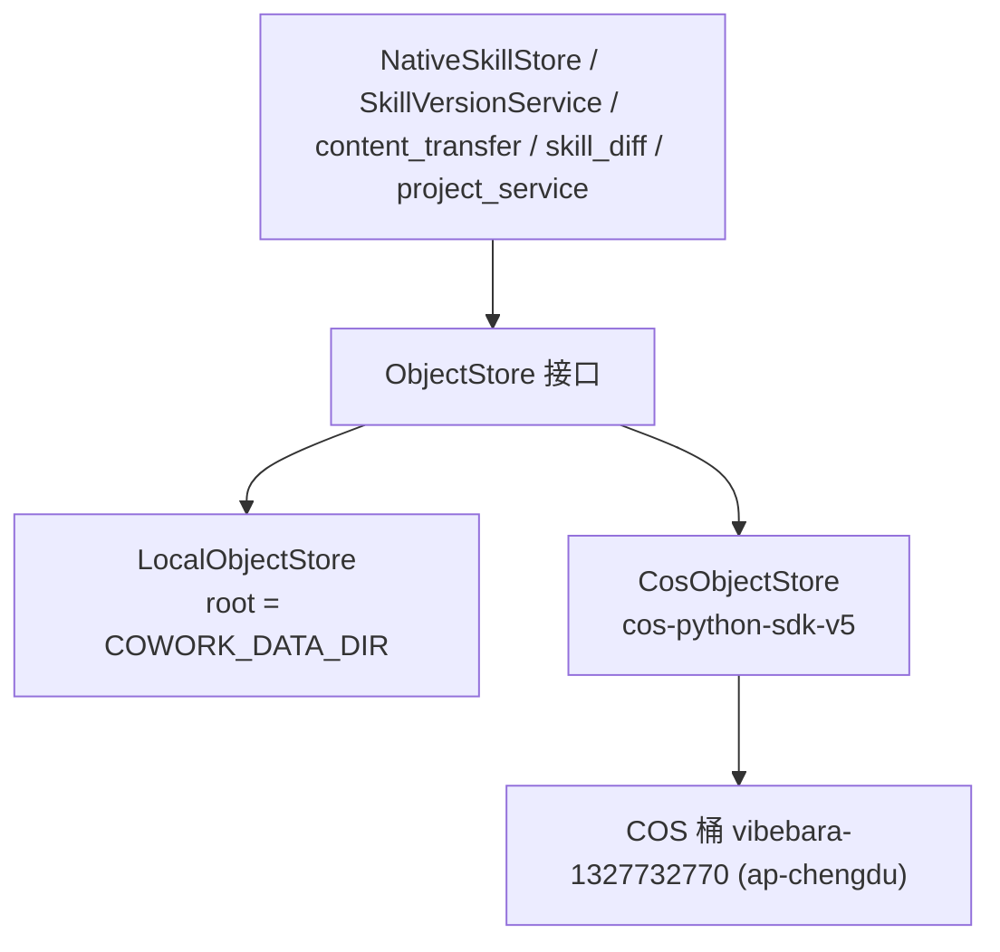

# 后端 Skill 存储迁移到腾讯云 COS（纯对象存储）— 设计与实现

## 1. 背景与目标

后端原先把平台 Skill 内容持久化在服务器本地磁盘（Docker 卷 `skill-store:/app/data`），分布在 `native_skill_store`、`skill_version_service`、`content_transfer`、`skill_diff_service`、`project_service` 等多处文件系统操作里。

目标：把持久化存储改为腾讯云 COS 对象存储，后端不再向本地盘落任何持久化 skill 文件。为不破坏本地开发，引入可插拔的 `ObjectStore` 抽象：

- `STORAGE_BACKEND=local`（默认）：`LocalObjectStore`，键映射到本地文件系统（保留现有开发体验）。
- `STORAGE_BACKEND=cos`（生产）：`CosObjectStore`，用 `cos-python-sdk-v5` 读写 COS。

桶：`vibebara-1327732770`（AppId 1327732770）、region `ap-chengdu`。

## 2. 安全提醒（重要）

桶当前为「公有读写」=任何人凭对象 URL 即可读 / 改 / 删 skill 内容，属高风险。本方案用 **SDK + SecretId/SecretKey** 访问，不依赖公共 ACL；**强烈建议尽快把桶收紧为私有**（仅密钥访问），代码无需任何改动。密钥务必只经环境变量注入，不入库、不入前端、不进 git。

## 3. ObjectStore 抽象



### 接口（同步；与现有阻塞式 IO 调用风格一致）

```python
class ObjectStore:
    def put_text(self, key: str, text: str) -> None
    def put_bytes(self, key: str, data: bytes) -> None
    def get_text(self, key: str) -> Optional[str]
    def get_bytes(self, key: str) -> Optional[bytes]
    def exists(self, key: str) -> bool
    def list(self, prefix: str) -> List[str]              # 前缀下所有对象键（递归）
    def delete_prefix(self, prefix: str) -> None           # 删前缀下全部对象
    def copy_prefix(self, src_prefix: str, dst_prefix: str) -> None  # 逐对象复制
    def compute_prefix_hash(self, prefix: str) -> str      # 见 §5
```

> 说明：COS 为网络 IO，调用慢于本地盘。当前代码本就以阻塞式 IO 运行于 async 函数中，本次保持同步实现（口径一致、改动可控）；如需进一步避免阻塞事件循环，可后续将 COS 调用下沉到线程池（不影响接口）。

## 4. 键布局（前缀即原目录）

`LocalObjectStore` 的 root 取 `COWORK_DATA_DIR`，键为相对路径，落地后与现有磁盘布局完全一致；`CosObjectStore` 在键前再拼可选 `COS_PREFIX`。

- 个人 Skill：`skills/personal/{owner_id}/{id}/skill.config.yaml`、`/SKILL.md`、`/scripts/**`、`/references/**`、`/assets/**`、`/LICENSE`
- 团队 Skill：`skills/team/{id}/...`
- 版本快照资源：`skill_versions/{skill_id}/{version_id}/scripts|references|assets/**`

个人 Skill 的 `id` 是内部 UUID，自然名保存在 `name`；数据库以 `(owner_id, name)` 保证用户内不重名，不同用户可以使用同一名称。DB 列 `store_path` 存「对象键前缀」（如 `skills/personal/{owner_id}/{uuid}`、`skills/team/foo-team-abc12345`），各消费者只按该字段寻址，不从自然名反推对象路径。旧数据约定丢弃，不执行历史前缀迁移。

## 5. 内容哈希口径（必须位级一致）

`compute_prefix_hash(prefix)` 复用既有算法（`_compute_dir_hash` / `project_service._compute_content_hash` / 本地代理同口径），仅把数据来源从「磁盘 rglob」改为「对象列举」：

1. 列举前缀下所有对象，计算每个对象相对前缀的 POSIX 路径 `rel`；
2. 按 `rel` 的 UTF-8 字节序排序；
3. 依次 `sha256.update(rel.encode) ; update(b"\\0") ; update(bytes) ; update(b"\\0")`；
4. 无对象返回 `""`。

注意：COS 无「空目录」概念，原本地实现也只对文件计哈希（空的 scripts/references/assets 目录不贡献），故两端结果一致。

## 6. 受影响文件

- 新增 [backend/app/services/object_store.py](backend/app/services/object_store.py)：接口 + `LocalObjectStore` + `CosObjectStore` + `get_object_store()` 单例工厂（按 `STORAGE_BACKEND`）。
- [backend/app/core/config.py](backend/app/core/config.py)：新增 `STORAGE_BACKEND`、`COS_BUCKET`、`COS_REGION`、`COS_SECRET_ID`、`COS_SECRET_KEY`、`COS_PREFIX`。
- [backend/requirements.txt](backend/requirements.txt)：加 `cos-python-sdk-v5`。
- [backend/app/services/native_skill_store.py](backend/app/services/native_skill_store.py)：所有 store 读写改对象操作（yaml/md/资源/hash、`copytree`→`copy_prefix`、`rmtree`→`delete_prefix`、`iterdir/rglob`→`list`）；`_sync_from_filesystem` 改按 COS 前缀列举重建索引；导入「源」仍走本地临时目录（瞬时处理），「目的」写 COS；`deploy` 从 COS 物化资源到目标盘。
- [backend/app/services/skill_version_service.py](backend/app/services/skill_version_service.py)：版本快照 / 回滚改 `skill_versions/` 前缀的对象读写。
- [backend/app/services/content_transfer.py](backend/app/services/content_transfer.py)：`collect_store_resources(prefix)` 改对象列举 + `get_bytes`。
- [backend/app/services/skill_diff_service.py](backend/app/services/skill_diff_service.py)：`_scan_resource_hashes(prefix)` 改对象列举取字节算 sha256。
- [backend/app/services/project_service.py](backend/app/services/project_service.py)：`_compute_content_hash(prefix)` 改 `object_store.compute_prefix_hash`。
- [backend/app/services/file_watcher_service.py](backend/app/services/file_watcher_service.py)：`STORAGE_BACKEND=cos` 时不启动 store 监听。
- [backend/app/main.py](backend/app/main.py)：初始化 ObjectStore；按 backend 决定是否监听 store。
- [docker-compose.yml](docker-compose.yml)：移除 `skill-store` 卷与挂载，新增 `STORAGE_BACKEND=cos` 与 `COS_*` env（密钥走 `.env`）。

## 7. 配置与部署

`.env`（与 docker-compose 同目录，不入 git）新增：

```env
STORAGE_BACKEND=cos
COS_BUCKET=vibebara-1327732770
COS_REGION=ap-chengdu
COS_SECRET_ID=你的SecretId
COS_SECRET_KEY=你的SecretKey
# 可选：桶内统一前缀（多套环境共享一个桶时区分），默认空
# COS_PREFIX=prod/
```

部署：

```bash
git pull && docker compose up -d --build
# 验证
curl http://localhost:8000/health
docker compose logs --tail=50 backend   # 关注 ObjectStore 初始化日志、首个 skill 读写
```

> `STORAGE_BACKEND=cos` 时不再需要 `skill-store` 卷；本地开发不配 `STORAGE_BACKEND`（默认 local），行为与之前一致。

## 8. 风险

- 改动面大（`native_skill_store` 为主，外加 version / diff / transfer / project 的 store 读取点），需逐方法核对。
- hash 口径须与现算法位级一致，否则 dirty / 版本判定错乱。
- 公有读写桶高风险，务必尽快收紧为私有。
- 启动 `_sync_from_filesystem` 由扫盘改列对象，skill 多时有列举开销；提供「信任 DB、跳过重建」开关。
- COS 网络抖动/超时需重试与错误处理（SDK 调用包一层 + 必要重试）。

## 9. 验证

- `python -m compileall backend/app` + `import app.main` + `configure_mappers()`。
- `STORAGE_BACKEND=local` 下对象存储 smoke：put/get/list/delete_prefix/copy_prefix/compute_prefix_hash 与旧文件实现结果一致。
- 生产 COS：配齐 `COS_*` env，端到端手测个人/团队 CRUD、导入（含从 IDE）、复制到团队、部署、提升、推送、拉取、版本回滚、删团队。
