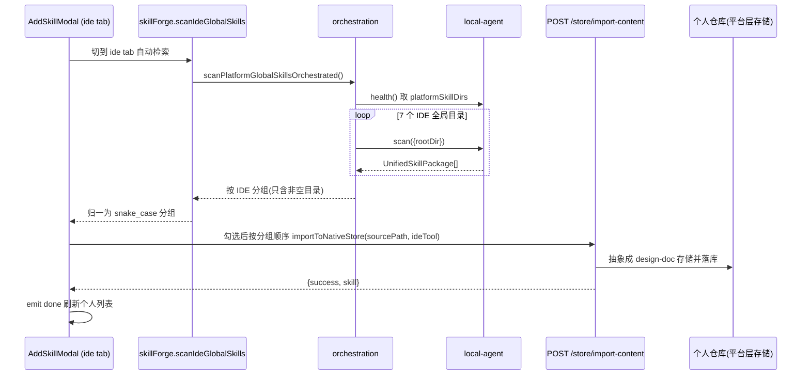

# 从 IDE 工具导入 Skill 到个人仓库 — 设计与实现

## 1. 功能背景与目标

Vibebara 已支持从「本地文件夹」「远程链接」「手动新建」三种方式把 Skill 导入个人仓库。本功能新增第四种入口——**从 IDE 工具导入**：直接检索本机已安装 IDE 的**全局 Skill 目录**（Cursor / Codex 等），把其中的原生 Skill 导入到个人仓库。

目标与约束：

- 入口位于「个人 Skill 仓库」页（SkillForge）的新增弹层 `AddSkillModal` 中，作为一个 tab。
- 仅限平台已支持的 IDE（当前 7 个：Cursor / Codex / Windsurf / Claude Code / Kiro / Trae / Qoder）。
- 导入遵循既有抽象：**先抽象成平台层存储（design-doc 格式落库），再按目标 IDE 部署**。本功能只新增「导入来源」，不改变部署链路。

## 2. 关键设计决策

- **形态**：应用内弹层（Modal），复用 `AddSkillModal`，不新开 Electron 窗口。
- **入口**：启用 `AddSkillModal` 中原有的占位 tab「从 IDE 工具导入」，仅在 `scope='personal'` 出现。
- **范围**：扫描全部 7 个受支持 IDE 的全局目录，**只展示本机实际存在且含 Skill 的目录**。
- **origin 判定**：以「扫描的是哪个 IDE 目录」为准（比 `scan` 自带的简化 origin 更准确），导入时用该 IDE 作为 `origin`。
- **仅桌面可用**：扫描用户 home 目录只能经本地代理，故本功能仅在桌面（编排）模式启用；Web 模式给出明确提示。

## 3. 复用的既有能力

本功能本质是「前端拼装」，底层能力已全部就绪：

- `localAgent.health()` → `platformSkillDirs`：返回 7 个 IDE 全局 Skill 目录的绝对路径（`frontend/src/api/localAgent.ts` `HealthResponse`）。
- `localAgent.scan({ rootDir })`：扫描任意目录下含 `SKILL.md` 的一级子目录，返回 `UnifiedSkillPackage[]`。
- `importToNativeStore(sourcePath, origin)`：编排模式下经 `importContentOrchestrated` → 本地代理 `read-folder` 读取文件夹内容 → `POST /skill-forge/store/import-content`，由后端 `NativeSkillStore` 抽象成 design-doc 格式落库个人仓库（`frontend/src/api/skillStore.ts`、`frontend/src/api/orchestration.ts`）。
- `getPlatformInstalledStatus()`：已示范「逐个扫描 7 个全局目录」的模式（`frontend/src/api/orchestration.ts`），本功能复用同款遍历。

部署回 IDE 的链路（各 IDE adapter 按目标平台适配/落盘）保持不变。

## 4. 数据流



## 5. 实现明细

涉及三个前端文件 + 一处后端落库逻辑（同名冲突处理）；无本地代理 / 适配器改动。

### 5.1 `frontend/src/api/orchestration.ts`

新增分组类型与扫描函数（仿 `getPlatformInstalledStatus`）：

```ts
export interface IdeSkillGroup {
  tool: ToolType
  dir: string
  packages: UnifiedSkillPackage[] // localAgent camelCase 包
}

export async function scanPlatformGlobalSkillsOrchestrated(): Promise<IdeSkillGroup[]> {
  const h = await localAgent.health()
  const dirs = h.platformSkillDirs
  const order: ToolType[] = ['cursor', 'codex', 'windsurf', 'claude', 'kiro', 'trae', 'qoder']
  const groups: IdeSkillGroup[] = []
  for (const tool of order) {
    const dir = dirs[tool]
    if (!dir) continue
    try {
      const res = await localAgent.scan({ rootDir: dir })
      if (res.packages.length) groups.push({ tool, dir, packages: res.packages })
    } catch {
      // 目录不存在/为空 → 跳过
    }
  }
  return groups
}
```

### 5.2 `frontend/src/api/skillForge.ts`

新增受灰度分流保护的封装。**关键点**：把包归一为本文件既有的 snake_case `UnifiedSkillPackage`（经 `normalizeScanPackage`），使弹层能复用「本地 / 链接」tab 同款渲染：

```ts
export interface IdeSkillGroup {
  tool: localAgent.ToolType
  dir: string
  packages: UnifiedSkillPackage[] // skillForge snake_case 包
}

export async function scanIdeGlobalSkills(): Promise<{
  success: boolean
  groups: IdeSkillGroup[]
  error?: string
}> {
  if (!isOrchestrationEnabled()) {
    return { success: false, groups: [], error: '该功能仅桌面客户端支持' }
  }
  try {
    const raw = await scanPlatformGlobalSkillsOrchestrated()
    const groups: IdeSkillGroup[] = raw.map((g) => ({
      tool: g.tool,
      dir: g.dir,
      packages: g.packages.map(normalizeScanPackage),
    }))
    return { success: true, groups }
  } catch (e) {
    const err = e as { message?: string }
    return { success: false, groups: [], error: err?.message || '检索失败' }
  }
}
```

### 5.3 `frontend/src/components/AddSkillModal.vue`

- **启用 tab**：去掉 `methods` 中 `ide` 项的 `disabled: true`。
- **展示名映射**：新增 `TOOL_LABELS`（cursor→Cursor、codex→Codex、windsurf→Windsurf、claude→Claude Code、kiro→Kiro、trae→Trae、qoder→Qoder），用于分组标题与 origin 徽标。
- **状态**：`ideScanLoading` / `ideScanned` / `ideGroups: IdeSkillGroup[]` / `selectedIdePaths: string[]`（以绝对 `source_path` 作唯一键，跨 IDE 也唯一），并新增计算属性 `ideAllPaths`（全部包路径，供全选 / 计数）。`resetIdeScan()` 接入 `resetAll()`。
- **自动检索**：`switchMethod` 中切到 `ide` tab 且未检索时自动调用 `scanIde()`（对应「首先检索各 IDE 全局目录」）。
- **顺序导入** `confirmAddFromIde()`：按分组顺序遍历勾选项，逐个 `importToNativeStore(pkg.source_path, group.tool)`，汇总成功 / 失败；全部成功走 `finishDone`，部分失败保持弹层打开并内联报错（与本地 / 链接 tab 一致）。
- **模板与按钮**：替换原占位块为「检索中转圈 → 按 IDE 分组列表（组标题 + 数量徽标 + 复选框 + 全选 / 取消）」；底部新增 `ide` 分支按钮「导入所选 (N)」，及未检索时的「检索 IDE 目录」回退按钮。
- **空态 / 错误**：无任何 IDE 目录含 Skill → 「未在本机各 IDE 全局目录发现可导入的 Skill（需包含 SKILL.md）」；orchestration 关闭或检索失败 → 复用 `addSkillError` 文案区显示「该功能仅桌面客户端支持」等。
- **同名冲突标记（个人仓库）**：检索完成后并行拉取 `listNativeSkills('personal')`，得到当前用户已有自然名集合 `personalNameSet`。`existsInPersonal(p)` 按扫描项名称判定是否与本人的个人仓库同名：
  - 已存在项：行内显示「已存在 · 勾选将覆盖」橙色徽标，且**默认不勾选**（默认跳过，避免误覆盖）；用户勾选即表示「覆盖」，导入时后端直接覆盖该个人 Skill。
  - 不存在项：默认勾选，正常导入。

### 5.4 `backend/app/services/native_skill_store.py`（用户级自然名空间）

个人 Skill 使用内部 UUID 作为 `id`，自然名独立保存在 `name`；数据库唯一约束为
`(owner_id, name)`。导入时只查询当前用户的同名记录：找到则复用该 UUID 并覆盖，
未找到则生成新 UUID，写入 `skills/personal/{owner_id}/{uuid}`。团队 Skill 和其他用户
即使使用相同自然名也不会产生主键或对象前缀冲突。

## 6. 边界与说明

- **仅桌面（编排）模式可用**：Web 模式直接提示，不发起扫描。
- **个人导入即快照、不跟踪**：从 IDE 全局目录导入个人仓库只是把内容快照落库，不建立部署跟踪关系。
- **同名冲突处理**：
  - 个人仓库同名 → 列表标「已存在」，默认跳过；勾选则覆盖（用户显式选择）。
  - 团队仓库同名或他人个人 Skill 同名 → 因表与用户命名空间隔离，可直接导入为当前用户的新 UUID。
- **同名 Skill 跨 IDE 重复**：按 IDE 分组分别展示，按上述冲突规则处理。
- **「按顺序点击导入」**：以多选 + 「导入所选」实现，内部按分组顺序 for 循环逐个导入，体验与本地 / 链接 tab 一致。
- **资源**：`read-folder` 以 `include:'skill'` 读取 `SKILL.md` 及 `scripts/references/assets/agents/LICENSE`，与本地文件夹导入同口径。

## 7. 验证

- `npx vue-tsc --noEmit` 类型检查通过。
- 改动文件 `ReadLints` 无报错；后端 `python -m py_compile native_skill_store.py` 通过。
- 端到端手测（需运行中的本地代理 + 已部署最新后端）：桌面壳启动后（`./build-desktop.ps1 -Quick -NoBe`）进入「个人 Skill 仓库 → + 新建 Skill → 从 IDE 工具导入」，确认：能检索到本机 Cursor / Codex 等全局目录的 Skill；本人同名项标「已存在」默认不勾选、勾选可覆盖；不同用户可各自导入同名 Skill，且对象前缀和 UUID 不同。

> 注意：本次后端落库逻辑改动需重新部署云端后端（`git pull && docker compose up -d --build`）才会在连云端的桌面壳上生效；前端改动需 `npm run build` 重建 dist 后重启桌面壳。
