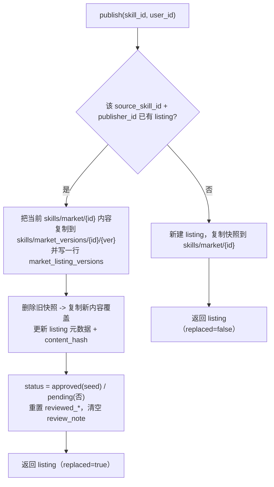

# SKILL 市场设计

SKILL 市场是个人 / 团队 Skill 的「公开分发」层：发布者把某个 Skill 当时的完整内容
复制成一份**独立市场快照**上架，经审核后全体可见，其他用户「获取」时再把快照复制一份到
自己的个人仓库。市场快照与源 Skill **不再同步**——发布之后源 Skill 的改动不会回写市场。

涉及代码：

- 后端：[backend/app/services/market_service.py](backend/app/services/market_service.py)、
  [backend/app/api/market.py](backend/app/api/market.py)、
  [backend/app/schemas/market.py](backend/app/schemas/market.py)、
  [backend/app/models/market_listing.py](backend/app/models/market_listing.py)、
  [backend/app/models/market_listing_version.py](backend/app/models/market_listing_version.py)
- 前端：[frontend/src/api/market.ts](frontend/src/api/market.ts)、
  [frontend/src/views/SkillMarket.vue](frontend/src/views/SkillMarket.vue)、
  [frontend/src/views/MarketSkillDetail.vue](frontend/src/views/MarketSkillDetail.vue)、
  [frontend/src/views/SkillForge.vue](frontend/src/views/SkillForge.vue)（发布入口）

## 核心概念

| 概念 | 说明 |
| --- | --- |
| 市场条目（listing） | `market_listings` 一行，对应「某发布者发布的某个 Skill」，是市场可见的最小单位。 |
| 市场快照 | 发布时把源 Skill 内容逐对象复制到 `skills/market/{market_id}/`，元数据冻结在 listing 行，**不与源同步**。 |
| 介绍页（intro） | 取自源 Skill `config.intro`（编辑页填写，可 AI 辅助），随快照带入：`intro_title/author/category/md`。 |
| 前一代版本 | 同一条目被重复推送时，被覆盖的上一版内容归档为 `market_listing_versions` 一行 + 一份独立快照。 |
| 审核态 | `pending`（待审核）/ `approved`（已通过，全体可见）/ `rejected`（已拒绝）。 |
| 溯源 | listing 软引用源：`source_scope`（personal/team）/ `source_skill_id` / `source_team_id`（不建强外键）。 |

## 权限与角色

- **发布者**：个人 Skill 仅本人可发布；团队 Skill 需团队成员（见 `_resolve_source_skill`）。
- **审核员（reviewer）**：种子用户或平台管理员（`auth_service.is_reviewer`），可访问审核队列、通过 / 拒绝、删除任意条目。
  - 种子用户（`is_seed_user`）发布 / 重推**免审核**，直接 `approved`。
- **获取者**：任意登录用户可获取 `approved` 的条目。
- 删除 / 撤回：发布者本人或审核员。

## 数据模型

### `market_listings`（[market_listing.py](backend/app/models/market_listing.py)）

| 列 | 说明 |
| --- | --- |
| `id` (PK) | 市场条目 id，同时是当前快照前缀 `skills/market/{id}` 的标识，**重推保持稳定**。 |
| `store_path` | 当前快照对象前缀。 |
| `display_name` / `description` / `short_description` / `version` / `tags` / `content_hash` | 元数据快照（发布时冻结）。 |
| `intro_title` / `intro_author` / `intro_category` / `intro_md` | 介绍页快照。 |
| `source_scope` / `source_skill_id` (index) / `source_team_id` | 溯源软引用。 |
| `publisher_id` (index) | 发布者。 |
| `status` (index) / `reviewed_by` / `reviewed_at` / `review_note` | 审核态。 |
| `created_at` / `updated_at` | 时间戳。 |

### `market_listing_versions`（[market_listing_version.py](backend/app/models/market_listing_version.py)）

被覆盖的「前一代版本」归档表，镜像 listing 快照字段，外加：

- `listing_id` (index, FK→`market_listings.id`)、`seq`（该 listing 维度单调递增 v1/v2/v3…）
- `store_path`（归档快照前缀 `skills/market_versions/{listing_id}/{version_id}`）
- `status`（归档时该代审核态）、`published_by` / `published_at`（该代原始发布者 / 发布时间）、`created_at`（归档时间）

### 迁移

- 开发环境：`init_db()` 走 `create_all`（`DB_AUTO_CREATE` 默认 True）自动建表。
- 云端：Alembic
  - `d4e5f6a7b8c9` 建 `market_listings`（含介绍页字段，兼容旧 `market_skills`）。
  - `e5f6a7b8c9d0` 建 `market_listing_versions`（`down_revision = d4e5f6a7b8c9`，在 `listing_id` 建索引）。
- 不加 `(source_skill_id, publisher_id)` 硬唯一约束（避免存量重复数据导致迁移失败），唯一性在应用层保证。

## 对象存储布局

```
skills/
  market/{market_id}/                 当前市场快照（config / SKILL 正文 / scripts·references·assets）
  market_versions/{listing_id}/
    {version_id}/                      前一代版本归档快照（同结构）
```

复用 `NativeSkillStore` 的对象存储助手：`copy_prefix` / `delete_prefix` / `compute_prefix_hash` /
`_read_store_config` / `_read_store_vibeh` / `_scan_store_resources` / `_safe_resource_rel`。

## 发布：去重覆盖 + 前一代版本归档

同一个 skill（按 `source_skill_id` + `publisher_id` 唯一）在市场只对应**一个条目**，
`market_id` 保持稳定（详情页 URL / 已获取态不变）。再次推送覆盖当前快照，上一版归档为前一代版本。



要点（`market_service.publish()`）：

- 介绍页字段取自源 Skill `config.intro`（best-effort，缺省回退到 `display_name` / 发布者名）。
- 首次发布：新建 listing，`copy_prefix(源, skills/market/{new_id})`。
- 再次发布（重推）：
  1. 归档：`copy_prefix(当前快照, skills/market_versions/{listing_id}/{version_id})`，写 `MarketListingVersion`
     （`seq = max(seq)+1`，拷贝旧 listing 元数据 / 介绍 / status / 原发布时间）。归档失败不阻断主流程。
  2. 覆盖：`delete_prefix(当前快照)` → `copy_prefix(源, 当前快照)`。
  3. 更新 listing 元数据与 `content_hash`，`status = approved`（seed）/ `pending`（否），重置审核字段。
- 返回值附 `replaced: bool`，供前端区分「首发 / 覆盖更新」提示文案。

## 列表与可见性

- `GET /market`（`list_market`）：`status == approved`，全体可见，按 `updated_at` 倒序。
- `GET /market/mine`：当前用户全部发布（含 pending / rejected），按 `created_at` 倒序。
- `GET /market/pending`（审核员）：待审核队列，按 `created_at` 升序（先到先审）。

> 非种子用户重推已通过条目会转回 `pending`，期间该条目从市场列表消失，审核通过后新内容才再次可见。

## 详情与介绍页

`GET /market/{id}`（`get_detail`）返回 `config` + `vibeh_content` + `store_path` + `listing`。
前端 [MarketSkillDetail.vue](frontend/src/views/MarketSkillDetail.vue) 以侧边 tab 只读渲染：

- 介绍（文章样式，`intro_*`）/ 基本信息 / SKILL 指令（正文）/ 资源 / 元数据 / 平台结构 / **历史版本**。
- 资源文件按需经 `GET /market/{id}/resource-file?path=` 读取。

## 历史版本（前一代版本）

- `GET /market/{id}/versions`：按 `seq` 倒序返回该条目的全部前一代版本元数据。
- `GET /market/{id}/versions/{version_id}`：读取归档快照前缀的 `config` / `vibeh_content` / `resources`，
  并合并父 listing 的 `publisher_name` / `source_scope` 等，结构与详情同构便于复用渲染。
- `GET /market/{id}/versions/{version_id}/resource-file?path=`：读取归档快照内单个资源文件。

前端：详情页「历史版本」tab 列出各代（`第 N 版` / 版本号 / 状态徽标 / 归档时间 / 「查看」）。
点击「查看」就地把该版本载入既有面板（只读），顶部显示前一代徽标与横幅，并把「获取」替换为「返回当前版本」；
资源面板使用版本 fileLoader。返回当前版本从本地缓存恢复，无需重新请求。

## 审核

- `POST /market/{id}/approve`（审核员）：`status = approved`。
- `POST /market/{id}/reject`（审核员，可带 `note`）：`status = rejected`，`review_note` 记原因。

## 获取（复制到个人仓库）

`POST /market/{id}/acquire`：校验 `approved` → `_unique_personal_name` 在当前用户命名空间内选择自然名 →
生成内部 UUID → `copy_prefix(当前快照, skills/personal/{owner_id}/{uuid})` → 改写 config
（`name` / `display_name` / `scope=personal` / 软引用 `source_skill_id=市场条目id`）→
upsert 个人 Skill 行。不同用户可以获取同名 Skill；获取始终针对**当前快照**，不针对历史版本。

## 删除 / 撤回

`DELETE /market/{id}`（发布者本人或审核员）：删除 listing + 当前快照前缀，并一并清理该条目的
全部 `market_listing_versions` 行与 `skills/market_versions/{listing_id}` 归档前缀（best-effort）。

## API 端点汇总

| 方法 | 路径 | 权限 | 说明 |
| --- | --- | --- | --- |
| GET | `/market` | 登录 | 市场列表（approved） |
| GET | `/market/mine` | 登录 | 我的发布 |
| GET | `/market/pending` | 审核员 | 审核队列 |
| POST | `/market/publish` | 登录（发布权限） | 发布 / 覆盖更新，返回 `replaced` |
| GET | `/market/{id}` | 登录 | 条目详情 |
| GET | `/market/{id}/resource-file?path=` | 登录 | 当前快照资源文件 |
| GET | `/market/{id}/versions` | 登录 | 历史版本列表 |
| GET | `/market/{id}/versions/{vid}` | 登录 | 历史版本详情 |
| GET | `/market/{id}/versions/{vid}/resource-file?path=` | 登录 | 历史版本资源文件 |
| POST | `/market/{id}/approve` | 审核员 | 审核通过 |
| POST | `/market/{id}/reject` | 审核员 | 审核拒绝 |
| POST | `/market/{id}/acquire` | 登录 | 获取到个人仓库 |
| DELETE | `/market/{id}` | 发布者 / 审核员 | 删除 / 撤回 |

> 路由顺序：`/{id}/versions/...` 等更具体路径声明在 `/{id}` 动态段之前，避免单段路径冲突。

## 前端视图

- [SkillMarket.vue](frontend/src/views/SkillMarket.vue)：市场主页，分页「市场 / 我的发布 / 审核（审核员）/ 管理员（种子用户）」。
- [MarketSkillDetail.vue](frontend/src/views/MarketSkillDetail.vue)：只读详情页（含历史版本 tab 与就地查看）。
- [SkillForge.vue](frontend/src/views/SkillForge.vue)：编辑页「发布到市场」按钮（需先保存、个人 Skill 可发布），
  按 `replaced` 区分提示：覆盖时「已更新发布，上一版已存为历史版本」（种子）/「已提交更新，等待管理员重新审核」（非种子）。

## 边界与兼容性

- **存量重复数据**：仅阻止「新的」重复推送；历史上已产生的多张 approved 重复卡片不自动合并
  （重推取最近一条覆盖，其余旧重复条目保留）。如需一次性清理，可后续单独做数据脚本。
- **拒绝后的状态**：非种子重推被拒绝时，listing 置 `rejected`、当前快照为新内容，前一代仍保留在历史版本中；
  不做自动回滚，发布者可在「我的发布」看到拒绝原因后再次推送。
- **团队 Skill**：同样按 (`source_skill_id`, `publisher_id`) 去重；不同成员发布同一团队 Skill 仍各自一条。
- **市场快照不回源**：发布后源 Skill 改动不会同步到市场；要更新市场内容需再次推送（即覆盖 + 归档）。

## 验证

- 种子用户连续两次推送同一个人 skill → 市场只一张卡片；详情页「历史版本」出现第 1 版，当前为新内容。
- 非种子用户：推送 → 通过；再次推送 → 条目转 `pending`、市场暂不显示，通过后显示新内容，历史版本含上一代。
- 撤回条目后，对应历史版本行与 `skills/market_versions/{id}` 归档前缀被清理。
